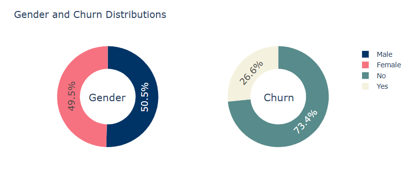
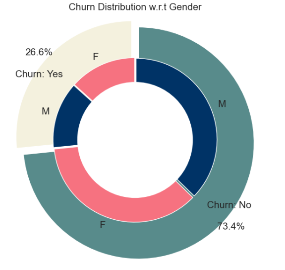
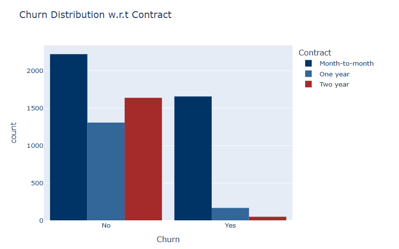
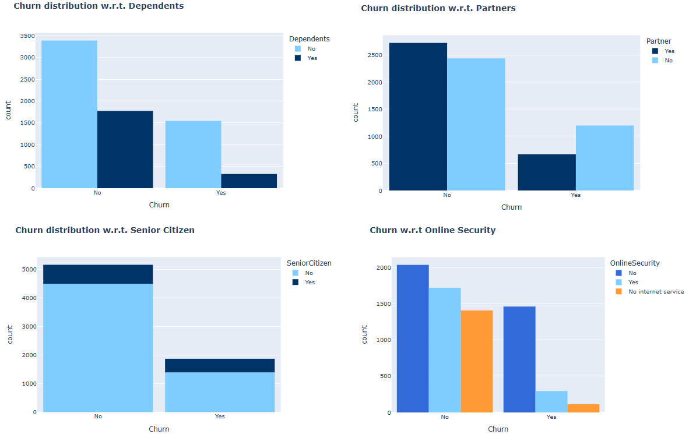
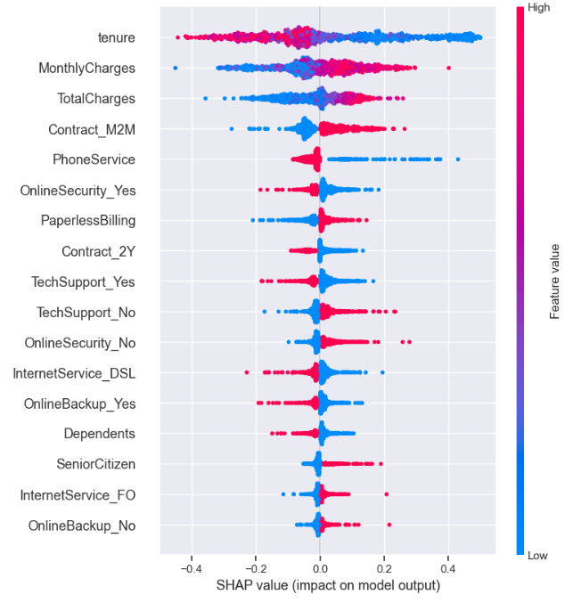

# Customer Churn Prediction : Project Overview
- Developed and compared several machine learning models (Logistic Regression, Gradient Boosting Classifier) demonstrated strong predictive performacne with an AUC score of `0.84` in identifying likely churners
- Fine-tuned the performacne of the classification models using GridSearchCV to achieve the final AUC score
- Performed interpretability analysis (using SHAP) to understand the factors driving the model's predictions, revealing specific customer attributes that strongly influence churn probability. The analysis revealed that contract type, monthly charges, and tenure were the strongest predictors of churn.
***

## Table of Contents
- [Introduction](#Introduction)
- [Project Requirements and Prerequisites](#Project-Requirements-and-Prerequisites)
- [Methodology](#Methodology)
  - [Data Cleaning](#Data-Cleaning)
  - [EDA](#EDA)
  - [Target and Feature variables distribution](#Target-and-Feature-variables-distribution)
  - [Data Preprocessing](#Data-Preprocessing)
  - [Building multiple ML models](#Building-multiple-ML-models)
  - [Model Performance](#Model-Performance)
  - [Interpretability analysis](#Interpretability-analysis)
***

## Introduction
Customer churn referes to the phenomenon where customers stops doing business with a particular service or a company. This is a critical concern for businesses across various industries as high churn rates can significantly impact revenue and growth.

The Telecom industry faces a lot of Churn(with annual churn rate of 15-25%) because the customers can choose from a variety of service providers and actively switch from existing to another. Identifying the potential churners beforehand is important as attaining new customers cost more than retaining existing ones. 

However, if a company could forecast why and which customers are likely to leave ahead of time, it can focus on customer retention efforts only on these "high risk" clients. This helps in achieving the goal of expanding its customer base and retrieve more customers loyalty.

**Objectives in the analysis**
- What variables are contributing to customer churn?
- Identifying customers who are more likely to churn?
- What actions can be taken to stop them from leaving?
***

## Project Requirements and Prerequisites
This project requires the following tools and software packages:

### Tools:
`Python 3`: Necessary for data analysis, EDA, and predictive modeling 

### Python Packages:
- `NumPy`, `Pandas`: For data analysis and manipulation
- `Matplotlib`, `Seaborn (optional)`, `Plotly`: For data visualization and EDA
- `sklearn`: For data preproccessing (Label Encoding, One-Hot Encoding, Standardization, Feature selection, etc. and building classification ML models.
- `xgboost`: For building gradient boosting models
- `tensorflow`: Necessary for building Feed-Forward Neural Network(FNN) a simple neural network
- `shap`: For performing interpretability analysis

### Clone the Repository and Istalling Python Dependencies:
1. Open terminal or command prompt and navigate to the directory where you want to store the project
   ```python
   cd directory_name
   ```
3. Run the code below to clone the repository
   ```python
   
   ```
3. Navigate to the project directory. This is necessary so that subsequent commands(like installing dependencies) are executed within the context of the project
   ```python
   cd repository_name
   ```
4. Installing Python Dependencies
   ```python
   pip install numpy pandas matplotlib seaborn plotly scikit-learn xgboost tensorflow shap
   ```
   
### Data:
This project utilizes the Telco Customer Churn dataset, which contains information about customers of telecommunications company. The dataset includes various features such as demographics, services subscribed to (phone, internet, streaming, etc.), account information (contract type, payment method, charges), and a binary target variable indicating whether the customer churned within the last month.
***

## Methodology

### Data Cleaning
After importing relevant libraries, loading data and going through data. We can observe some inconsistencies in our data which needs to be cleaned before performing analysis or building models. Following changes were made in data cleaning part:
- Drop `customerID` column as it is not useful for our analysis
- Drop rows with blank values
- Change the datatype of `totalCharges` to numeric
- Change the datatype of `seniorCitizen` to string
***

### EDA
In this part of the project, we create visualizations to answer some question like
1. What is the percentage of customers who are with active services and customers who churn?
   <p align=center>
     
   </p>
   
2. Does gender play a role in customers churn?
   <p align=center>
     
   </p>
   
3. Does the type of service provided leads to more/less customers churn?
   <p align=center>
     
   </p>
   
4. Churn distribution w.r.t other variables
   <p align=center>
     
   </p>

We can draw following conclusions from EDA results
- Churn rates are similar for both male and female customers
- Churn is highly concentrated among customers with Month-to-Month customers (Customers with 2 years contracts exhibit the lowest churn)
- Customers without dependents are more likely to churn
- Customres without partners are more likely to churn
- Absence of online security makes most customers churn 
***

### Target and Feature variables distribution
From the distributions we can say that
1. Tenure vs Churn
   - Customres who leave are those who haven't been with the company for very long
   - Customers who have stayed with the company for a longer time are much less likely to cancel their service
2. Monthly Charges vs Churn
   - High Monthly charges are also one of a reason which makes customers more likely to churn
3. Total Charges vs Churn
   - Customers with lower total spending are more likely to churn
   - Customers who spend higher total charges are less likely to churn
***

### Data Preprocessing
In preprocessing stage, we will do the following tasks:
1. Label Encoding
2. Splitting data into training and testing sets
3. Standardizing numerical features(only training data)
4. Then performing feature selection usinf RFECV
5. One-hot encoding 
***

### Building multiple ML models
After transforming our data into a format suitable for analysis, we explored seven different models and evaluated their performance using `AUC score`. We specifically chose `AUC score` because the imbalanced nature of the churn data makes accuracy a less reliable metric for assessing the models effectiveness.

- `Logistic Regression` - Used as a baseline model.
- `Decision Tree Classifier` - DTs can handle both categorical and numerical features without extensive preprocessing.
- `Random Forest Classifier` - ensemble method known for its robustness to overfitting and its ability to handle complex relationships
- `Support Vector Classifier(SVC)` - SVC is preferred for binary classification due to its ability to find the optimal hyperplane that best separates the two classes with the largest margin, aiming for robust generalization.
- `Gradient Boosting Classifier` - Utilized as a powerful ensemble technique that builds trees sequentially, correcting errors from previous trees.
- `XGBoost`- Another gradient boosting implementation, often optimized for speed and performance. It includes regularization techniques and can handle missing values.
- `Feed-Forward Neural Network(FNN)` - Explored as a non-linear model capable of learning complex patterns from the data. NNs can be particularly effective when dealing with inricate relationships b/w features, they require careful tuning and more data.
***

### Model Performance
| Model | Accuracy | AUC score |
|---|---|---|
| Logistic Regression | 0.80 | 0.84 |
| Decision Tree Classifier | 0.79 | 0.83 |
| Random Forest Classifier | 0.78 | 0.80 |
| Support Vector Classifier(SVC) | 0.79 | 0.83 |
| Gradient Boosting Classifier | 0.80 | 0.84 |
| XGBoost | 0.77 | 0.81 |
| Feed-Forward Neural Network | 0.80 | 0.83 |
***

### Interpretability analysis
Interpretability analysis (using SHAP) is performed to understand the factors driving the model's predictions, revealing specific customer attributes that strongly influence churn probability
<p align=center>
  
</p>
***
